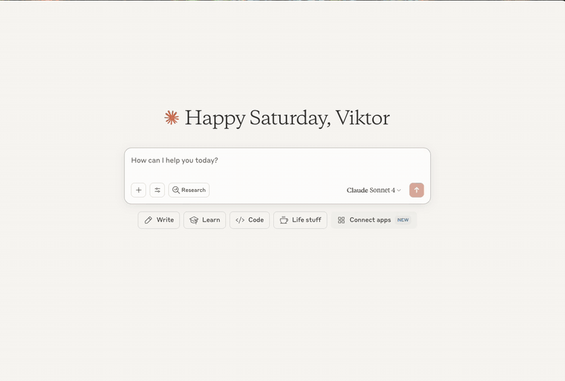
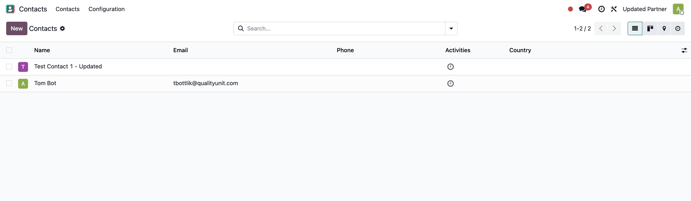

# Odoo MCP Server (Hybrid)

A hybrid Model Context Protocol (MCP) server that enables AI assistants to interact with Odoo ERP systems. Supports both **HTTP streaming** (for web AI agents) and **stdio** (for local AI assistants) modes.

## 📺 Demo

### stdio Mode Demo (Claude Desktop)


### HTTP Mode Demo (AI Agents & Remote Access)


### Example Output



## 🚀 Quick Start

### HTTP Mode (AI Agents & Remote Access)

```bash
# Clone the repository
git clone https://github.com/vzeman/odoo-mcp-server.git
cd odoo-mcp-server

# Copy example and configure
cp docker-compose.example.yml docker-compose.yml
# Edit docker-compose.yml with your Odoo credentials

# Start with Docker Compose
docker-compose up -d

# Access the server
curl http://localhost:8000/health
```

### stdio Mode (Claude Desktop)

#### Option 1: Install from PyPI (recommended)

```bash
# Install
pip install odoo-mcp-server
```

#### Option 2: Install from source

```bash
# Clone the repository
git clone https://github.com/vzeman/odoo-mcp-server.git
cd odoo-mcp-server

# Install in development mode
pip install -e .
```

#### Configure Claude Desktop

Add to your Claude Desktop config file:

**macOS**: `~/Library/Application Support/Claude/claude_desktop_config.json`  
**Windows**: `%APPDATA%/Claude/claude_desktop_config.json`

```json
{
  "mcpServers": {
    "odoo": {
      "command": "python",
      "args": ["-m", "mcp_server_odoo"],
      "env": {
        "ODOO_URL": "https://your-instance.odoo.com",
        "ODOO_DB": "your-database",
        "ODOO_USERNAME": "your-email@example.com",
        "ODOO_API_KEY": "your-api-key"
      }
    }
  }
}
```

### Local Development

```bash
# Clone the repository
git clone https://github.com/vzeman/odoo-mcp-server.git
cd odoo-mcp-server

# Install dependencies
pip install -e .

# Set environment variables
export ODOO_URL="https://your-instance.odoo.com"
export ODOO_DB="your-database"
export ODOO_USERNAME="your-email@example.com"
export ODOO_API_KEY="your-api-key"

# Run the HTTP server
python -m mcp_server_odoo.http_server

# Run the stdio server
python -m mcp_server_odoo
```

## 🌐 Remote Access with ngrok (AI Agent Integration)

This implementation allows you to expose your local MCP server to AI agents like Flowhunt, enabling remote automation of your Odoo business processes.

### Why Use ngrok?

- **Remote AI Access**: AI agents can connect to your MCP server from anywhere
- **Business Automation**: Enable Flowhunt and other AI platforms to automate your Odoo workflows
- **Secure Tunneling**: ngrok provides secure HTTPS tunnels with authentication
- **No Infrastructure**: No need to deploy to cloud servers

### Setup Instructions

#### 1. Install ngrok

**Download and Install:**
```bash
# macOS (using Homebrew)
brew install ngrok

# Or download directly from https://ngrok.com/download
```

**Sign up and get your authtoken:**
1. Go to [ngrok.com](https://ngrok.com) and create a free account
2. Get your authtoken from the dashboard
3. Configure ngrok:
```bash
ngrok config add-authtoken YOUR_AUTHTOKEN_HERE
```

#### 2. Start Your MCP Server

```bash
# Start the MCP server with Docker
docker-compose up -d

# Verify it's running locally
curl http://localhost:8000/health
```

#### 3. Create ngrok Tunnel

```bash
# Create a public tunnel to your local MCP server
ngrok http http://localhost:8080

# You'll see output like:
# Session Status                online
# Account                       your-email@example.com
# Version                       3.x.x
# Region                        United States (us)
# Latency                       -
# Web Interface                 http://127.0.0.1:4040
# Forwarding                    https://abc123.ngrok-free.app -> http://localhost:8000
```

**Copy the HTTPS URL** (e.g., `https://abc123.ngrok-free.app`) - this is your public MCP server endpoint.

#### 4. Configure Flowhunt Integration

**Flowhunt Implementation Process:**

Create a custom flow with AI Agents:

1. **Create a New Flow:**
   - Go to Flowhunt Dashboard
   - Click "Create New Flow"
   - Give your flow a name (e.g., "Odoo Business Automation")

2. **Add AI Agent Component:**
   - Drag and drop an "AI Agent" component into your flow
   - Connect the AI Agent to:
     - **Input**: Data source or trigger
     - **Output**: Next step in your workflow
     - **Chat History**: For context and conversation memory
     - **MCP Server**: Your Odoo MCP server

3. **Configure MCP Server Connection:**
   - In the AI Agent settings, go to "MCP Server Configuration"
   - **Server URL**: `https://abc123.ngrok-free.app`
   - **Protocol**: HTTP/HTTPS
   - **Authentication**: None (or configure as needed)
   - Save the configuration

4. **Test the Connection:**
   - In your Flowhunt flow, start a chat with the AI Agent
   - Ask the AI to test the Odoo connection, for example:
     ```
     "Can you list all available Odoo models?"
     "Show me the first 5 customers in the system"
     "What tools are available for Odoo operations?"
     ```
   - The AI should be able to access your Odoo data through the MCP server

#### 5. Flowhunt Workflow Examples

**Complete Flow Setup Process:**

1. **Customer Follow-up Flow:**
   ```
   Trigger: Daily schedule or webhook
   ↓
   AI Agent: "Find customers who haven't purchased in 6 months"
   ↓ (uses MCP: search_records)
   AI Agent: "Create follow-up tasks for each customer"
   ↓ (uses MCP: create_record)
   Output: Email report or Slack notification
   ```

2. **Sales Order Automation:**
   ```
   Trigger: New lead qualification webhook
   ↓
   AI Agent: "Check if lead is qualified and ready for sales order"
   ↓ (uses MCP: search_records, get_record)
   AI Agent: "Create sales order with appropriate products"
   ↓ (uses MCP: create_record)
   Output: Sales order confirmation email
   ```

3. **Inventory Management Flow:**
   ```
   Trigger: Hourly schedule
   ↓
   AI Agent: "Check all products for low stock levels"
   ↓ (uses MCP: search_records)
   AI Agent: "Create purchase orders for items below reorder point"
   ↓ (uses MCP: create_record)
   Output: Purchase order notifications to procurement team
   ```

**AI Agent Prompts for Odoo Operations:**

```bash
# Customer Management
"Search for all customers in California with more than $10,000 in total sales"

# Sales Operations
"Create a new sales order for customer ID 42 with 5 units of product ID 123"

# Inventory Tracking
"Find all products with stock quantity below 10 and create purchase orders"

# Financial Reporting
"Generate a report of all unpaid invoices from the last 30 days"
```

### Advanced ngrok Configuration

#### Custom Subdomain (Paid Plan)
```bash
# Use a custom subdomain for consistent URLs
ngrok http 8000 --subdomain=my-odoo-mcp
# Results in: https://my-odoo-mcp.ngrok.io
```

#### Authentication & Security
```bash
# Add basic authentication
ngrok http 8000 --basic-auth="username:password"

# Add custom headers
ngrok http 8000 --request-header-add="X-Custom-Header: value"
```

#### Multiple Tunnels
```bash
# Create multiple tunnels for different services
ngrok http 8000 --subdomain=odoo-mcp
ngrok http 3000 --subdomain=odoo-web
```

### Production Considerations

#### 1. Persistent Tunnels
For production use, consider:
- **ngrok Pro/Enterprise**: For persistent URLs and custom domains
- **Self-hosted ngrok**: For complete control
- **Alternative solutions**: Cloudflare Tunnel, localtunnel, etc.

#### 2. Security Best Practices
```bash
# Use authentication
ngrok http 8000 --basic-auth="admin:secure-password"

# Restrict to specific IPs (if using ngrok Pro)
ngrok http 8000 --allow-cidr="192.168.1.0/24"

# Use custom domains with SSL
ngrok http 8000 --hostname=your-domain.com
```

#### 3. Monitoring & Logs
```bash
# View ngrok web interface
# Open http://127.0.0.1:4040 in your browser

# Monitor requests and responses
# Check MCP server logs
docker-compose logs -f mcp-server
```

### Troubleshooting

#### Common Issues

**1. ngrok Tunnel Not Working:**
```bash
# Check if ngrok is authenticated
ngrok config check

# Verify local server is running
curl http://localhost:8000/health

# Check ngrok status
ngrok status
```

**2. AI Agent Can't Connect:**
- Try asking the AI Agent simple questions in the chat:
  ```
  "What Odoo models are available?"
  "Can you search for customers?"
  ```
- Check if the AI responds with Odoo data or error messages
- Verify the MCP Server URL is correct in the AI Agent settings
- Ensure the ngrok tunnel is still active (check ngrok dashboard)

**3. Authentication Issues:**
- If you configured basic authentication in ngrok, ensure the AI Agent settings include the credentials
- Test in the AI chat by asking: "Can you access the Odoo system?"
- Check the AI Agent's MCP Server configuration for authentication settings
- Verify the ngrok tunnel is configured with the same auth credentials

### Integration Examples

#### Flowhunt Flow Configuration
**In Flowhunt Dashboard:**

1. **Flow Structure:**
   ```
   [Input/Trigger] → [AI Agent] → [Output/Action]
                        ↓
                   [Chat History]
                        ↓
                   [MCP Server] ← ngrok URL
   ```

2. **AI Agent MCP Settings:**
   - **MCP Server URL**: `https://abc123.ngrok-free.app`
   - **Connection Type**: HTTP/HTTPS
   - **Authentication**: None (or Basic Auth if configured)
   - **Available Tools**: All 12 Odoo MCP tools will be automatically detected

3. **Flow Example Configuration:**
   ```yaml
   Flow Name: "Odoo Customer Management"
   Components:
     - Input: Webhook/API trigger
     - AI Agent: 
       - Model: GPT-4 or Claude
       - MCP Server: https://abc123.ngrok-free.app
       - Chat History: Enabled
     - Output: Email notification or webhook response
   ```

#### Custom AI Agent Integration
```python
import requests

class RemoteOdooMCPClient:
    def __init__(self, ngrok_url, auth=None):
        self.base_url = ngrok_url.rstrip('/')
        self.auth = auth
    
    def call_tool(self, tool_name, **kwargs):
        response = requests.post(
            f"{self.base_url}/",
            json={
                "jsonrpc": "2.0",
                "id": 1,
                "method": "tools/call",
                "params": {
                    "name": tool_name,
                    "arguments": kwargs
                }
            },
            auth=self.auth
        )
        return response.json()

# Usage
client = RemoteOdooMCPClient("https://abc123.ngrok-free.app")
customers = client.call_tool("search_records", model="res.partner", limit=10)
```

This setup enables powerful AI-driven automation of your Odoo business processes through secure remote access!

## Custom MCP Server Development
We develop MCP Servers for customers, if you need MCP server for your own system similar to Odoo MCP server, please contact us (https://www.flowhunt.io/contact/). 
Here is the description how we develop MCP Servers for our customers: https://www.flowhunt.io/services/mcp-server-development/

## Demo

📺 [Watch the demo on YouTube](https://youtu.be/tanzyt_qEmE)


## Features

- 🔍 **Search Records**: Query any Odoo model with complex domain filters
- ➕ **Create Records**: Add new records to any Odoo model
- ✏️ **Update Records**: Modify existing records
- 🗑️ **Delete Records**: Remove records from the system
- 📊 **Read Records**: Fetch detailed information about specific records
- 📋 **List Models**: Discover available models in your Odoo instance
- 🔧 **Model Introspection**: Get field definitions for any model
- 🌐 **HTTP Streaming**: Full MCP Streamable HTTP transport support
- 🐳 **Docker Ready**: Complete containerization with Docker Compose
- 🔄 **Server-Sent Events**: Real-time streaming responses
- 🛡️ **Security**: Origin validation, CORS support, and session management
- 📊 **Monitoring**: Health checks, metrics, and observability

## Installation

### 🐳 Docker (Recommended)

```bash
# Clone the repository
git clone https://github.com/vzeman/odoo-mcp-server.git
cd odoo-mcp-server

# Copy environment file and configure
cp .env.example .env
# Edit .env with your Odoo credentials

# Start with Docker Compose
docker-compose up -d
```

### 📦 Via pip

```bash
pip install odoo-mcp-server
```

### 🔧 From source

```bash
git clone https://github.com/vzeman/odoo-mcp-server.git
cd odoo-mcp-server
pip install -e .
```

## Configuration

### Environment Variables

Create a `.env` file in your project directory or set these environment variables:

```env
ODOO_URL=https://your-instance.odoo.com
ODOO_DB=your-database-name
ODOO_USERNAME=your-username@example.com
ODOO_API_KEY=your-api-key-here
```

### Getting Odoo Credentials

1. **API Key**: 
   - Log into your Odoo instance
   - Go to Settings → Users & Companies → Users
   - Select your user
   - Under "API Keys" or "Security" tab, create a new API key
   - Copy the key immediately (it won't be shown again)

2. **Database Name**:
   - Usually visible in the URL when logged in
   - Or check Settings → Activate Developer Mode → Database Info

3. **Username**:
   - Your login email address

## 🚀 Quick Start

### Docker Deployment

1. **Clone and configure**:
```bash
git clone https://github.com/vzeman/odoo-mcp-server.git
cd odoo-mcp-server
```

2. **Configure your Odoo credentials**:
```bash
# Copy the example file
cp docker-compose.example.yml docker-compose.yml

# Edit docker-compose.yml with your Odoo credentials
nano docker-compose.yml
```

Or edit the environment section directly:
```yaml
environment:
  - ODOO_URL=https://your-instance.odoo.com
  - ODOO_DB=your-database-name
  - ODOO_USERNAME=your-username@example.com
  - ODOO_API_KEY=your-api-key-here
```

3. **Start the services**:
```bash
# Basic deployment
docker-compose up -d

# With monitoring stack
docker-compose --profile monitoring up -d

# With nginx proxy
docker-compose --profile proxy up -d
```

4. **Access the server**:
- **MCP Endpoint**: `http://localhost:8000/mcp` or `http://localhost:8000/` (POST)
- **Health Check**: `http://localhost:8000/health`
- **API Documentation**: `http://localhost:8000/docs`
- **Server Info**: `http://localhost:8000/` (GET)

### Local Development

```bash
# Install dependencies
pip install -e .

# Set environment variables
export ODOO_URL="https://your-instance.odoo.com"
export ODOO_DB="your-database"
export ODOO_USERNAME="your-email@example.com"
export ODOO_API_KEY="your-api-key"

# Run the HTTP server
python -m mcp_server_odoo
```

## 🔌 Client Integration

### MCP Server Inspector

The server is fully compatible with the MCP Server Inspector. Use these connection settings:

- **URL**: `http://localhost:8000`
- **Method**: `POST`
- **Content-Type**: `application/json`
- **Endpoint**: `/` (root endpoint)

The server automatically handles both GET (server info) and POST (MCP protocol) requests on the root endpoint.

### HTTP Streaming Client

Connect to the MCP server using HTTP streaming transport:

```python
import httpx
import json

# Initialize session
response = httpx.post(
    "http://localhost:8000/mcp",
    json={
        "jsonrpc": "2.0",
        "id": 1,
        "method": "initialize",
        "params": {
            "protocolVersion": "2024-11-05",
            "capabilities": {},
            "clientInfo": {"name": "test-client", "version": "1.0.0"}
        }
    },
    headers={"Accept": "application/json, text/event-stream"}
)

# Get session ID from response headers
session_id = response.headers.get("Mcp-Session-Id")

# Make tool calls
response = httpx.post(
    "http://localhost:8000/mcp",
    json={
        "jsonrpc": "2.0",
        "id": 2,
        "method": "tools/call",
        "params": {
            "name": "search_records",
            "arguments": {
                "model": "res.partner",
                "domain": [["is_company", "=", True]],
                "limit": 10
            }
        }
    },
    headers={
        "Mcp-Session-Id": session_id,
        "Accept": "application/json, text/event-stream"
    }
```

### Server-Sent Events (SSE) Streaming

For real-time streaming responses:

```python
import httpx
import json

# Stream responses using SSE
with httpx.stream(
    "POST",
    "http://localhost:8000/mcp",
    json={
        "jsonrpc": "2.0",
        "id": 1,
        "method": "tools/call",
        "params": {
            "name": "search_records",
            "arguments": {
                "model": "res.partner",
                "domain": [["is_company", "=", True]],
                "limit": 10
            }
        }
    },
    headers={"Accept": "text/event-stream"}
) as response:
    for line in response.iter_lines():
        if line.startswith("data: "):
            data = json.loads(line[6:])  # Remove "data: " prefix
            print(f"Received: {data}")
```

### JSON Integration

The server provides a comprehensive JSON API for direct integration with any application. All MCP protocol methods are available via standard HTTP POST requests.

#### Basic JSON Request Format

```json
{
  "jsonrpc": "2.0",
  "id": 1,
  "method": "method_name",
  "params": {
    "parameter1": "value1",
    "parameter2": "value2"
  }
}
```

#### Example: Initialize Connection

```bash
curl -X POST http://localhost:8000/ \
  -H "Content-Type: application/json" \
  -d '{
    "jsonrpc": "2.0",
    "id": 1,
    "method": "initialize",
    "params": {
      "protocolVersion": "2024-11-05",
      "capabilities": {},
      "clientInfo": {"name": "my-app", "version": "1.0.0"}
    }
  }'
```

#### Example: List Available Tools

```bash
curl -X POST http://localhost:8000/ \
  -H "Content-Type: application/json" \
  -d '{
    "jsonrpc": "2.0",
    "id": 2,
    "method": "tools/list",
    "params": {}
  }'
```

#### Example: Call a Tool

```bash
curl -X POST http://localhost:8000/ \
  -H "Content-Type: application/json" \
  -d '{
    "jsonrpc": "2.0",
    "id": 3,
    "method": "tools/call",
    "params": {
      "name": "search_records",
      "arguments": {
        "model": "res.partner",
        "limit": 5
      }
    }
  }'
```

#### JavaScript/Node.js Integration

```javascript
const axios = require('axios');

class OdooMCPClient {
  constructor(baseUrl = 'http://localhost:8000') {
    this.baseUrl = baseUrl;
    this.requestId = 1;
  }

  async call(method, params = {}) {
    const response = await axios.post(this.baseUrl, {
      jsonrpc: "2.0",
      id: this.requestId++,
      method: method,
      params: params
    }, {
      headers: { 'Content-Type': 'application/json' }
    });
    
    return response.data.result;
  }

  async searchRecords(model, options = {}) {
    return this.call('tools/call', {
      name: 'search_records',
      arguments: { model, ...options }
    });
  }

  async createRecord(model, values) {
    return this.call('tools/call', {
      name: 'create_record',
      arguments: { model, values }
    });
  }
}

// Usage
const client = new OdooMCPClient();
const partners = await client.searchRecords('res.partner', { limit: 10 });
console.log(partners);
```

#### Python Integration

```python
import requests
import json

class OdooMCPClient:
    def __init__(self, base_url="http://localhost:8000"):
        self.base_url = base_url
        self.request_id = 1
    
    def call(self, method, params=None):
        payload = {
            "jsonrpc": "2.0",
            "id": self.request_id,
            "method": method,
            "params": params or {}
        }
        self.request_id += 1
        
        response = requests.post(
            self.base_url,
            json=payload,
            headers={"Content-Type": "application/json"}
        )
        return response.json()["result"]
    
    def search_records(self, model, **options):
        return self.call("tools/call", {
            "name": "search_records",
            "arguments": {"model": model, **options}
        })
    
    def create_record(self, model, values):
        return self.call("tools/call", {
            "name": "create_record",
            "arguments": {"model": model, "values": values}
        })

# Usage
client = OdooMCPClient()
partners = client.search_records("res.partner", limit=10)
print(partners)
```

#### MCP Client Integration

For Claude Desktop, Cursor, or other MCP clients, use this configuration:

**Claude Desktop** (`claude_desktop_config.json`):
```json
{
  "mcpServers": {
    "odoo-mcp-server": {
      "command": "npx",
      "args": [
        "-y",
        "mcp-remote",
        "http://localhost:8000"
      ]
    }
  }
}
```

**Cursor** (`.cursor/mcp.json`):
```json
{
  "mcpServers": {
    "odoo-mcp-server": {
      "command": "npx",
      "args": [
        "-y",
        "mcp-remote",
        "http://localhost:8000"
      ]
    }
  }
}
```

**Setup Steps:**
1. Start your MCP server: `docker-compose up -d`
2. Install mcp-remote: `npm install -g mcp-remote`
3. Add the configuration above to your MCP client
4. Restart your MCP client
5. You'll have access to all 12 Odoo tools!

**✅ Current Status:** 
- HTTP JSON-RPC endpoints work correctly via `curl`
- All 12 Odoo tools are fully functional
- Server connects to Odoo and executes operations successfully

**Working Configuration for JSON-RPC:**
```bash
# Test via curl (this works):
curl -X POST http://localhost:8000/ \
  -H "Content-Type: application/json" \
  -d '{
    "jsonrpc": "2.0",
    "id": 1,
    "method": "tools/call",
    "params": {
      "name": "search_count",
      "arguments": {"model": "res.partner"}
    }
  }'
```

## Available Tools

- **search_records** - Search for records in any Odoo model
- **get_record** - Get detailed information about specific records
- **create_record** - Create new records in Odoo
- **update_record** - Update existing records
- **delete_record** - Delete records from Odoo
- **list_models** - Discover available models in your Odoo instance
- **get_model_fields** - Get field definitions for a model

## 🐳 Docker Services

### Core Services

- **mcp-server**: Main MCP server with HTTP streaming
- **redis**: Session management and caching (optional)
- **nginx**: Reverse proxy with SSL termination (optional)

### Service Management

```bash
# Start basic services
docker-compose up -d

# Start with Redis for session management
docker-compose --profile redis up -d

# Start with Nginx reverse proxy
docker-compose --profile proxy up -d

# View logs
docker-compose logs -f mcp-server

# Scale services
docker-compose up -d --scale mcp-server=3

# Update services
docker-compose pull
docker-compose up -d

# Stop services
docker-compose down

# Clean up
docker-compose down -v --remove-orphans
```

### Endpoints

- **MCP Endpoint**: `http://localhost:8000/mcp` or `http://localhost:8000/` (POST)
- **Health Check**: `http://localhost:8000/health`
- **API Documentation**: `http://localhost:8000/docs`
- **Server Info**: `http://localhost:8000/` (GET)

## 🔧 Development

### Local Development Setup

```bash
# Clone repository
git clone https://github.com/vzeman/odoo-mcp-server.git
cd odoo-mcp-server

# Create virtual environment
python -m venv venv
source venv/bin/activate  # On Windows: venv\Scripts\activate

# Install in development mode
pip install -e ".[dev]"

# Set up environment
cp .env.example .env
# Edit .env with your configuration

# Run the server
python -m mcp_server_odoo
```

### Testing

```bash
# Install test dependencies
pip install -e ".[dev]"

# Run tests
pytest

# Run with coverage
pytest --cov=mcp_server_odoo

# Test HTTP endpoints
curl -X POST http://localhost:8000/mcp \
  -H "Content-Type: application/json" \
  -H "Accept: application/json, text/event-stream" \
  -d '{"jsonrpc":"2.0","id":1,"method":"initialize","params":{"protocolVersion":"2024-11-05","capabilities":{},"clientInfo":{"name":"test","version":"1.0"}}}'
```

### Code Quality

```bash
# Type checking
mypy mcp_server_odoo

# Linting and formatting
ruff check .
ruff format .

# Security scanning
bandit -r mcp_server_odoo
```

### Docker Development

```bash
# Build development image
docker build -t odoo-mcp-server:dev .

# Run development container
docker run -p 8000:8000 \
  -e ODOO_URL="https://demo.odoo.com" \
  -e ODOO_DB="demo" \
  -e ODOO_USERNAME="demo" \
  -e ODOO_API_KEY="your-key" \
  odoo-mcp-server:dev

# Development with volume mounting
docker run -p 8000:8000 \
  -v $(pwd)/mcp_server_odoo:/app/mcp_server_odoo \
  -e ODOO_URL="https://demo.odoo.com" \
  odoo-mcp-server:dev
```

## Contributing

Contributions are welcome! Please feel free to submit a Pull Request.

## License

This project is licensed under the MIT License - see the LICENSE file for details.

## Support

For issues and feature requests, please use the [GitHub issue tracker](https://github.com/vzeman/odoo-mcp-server/issues).